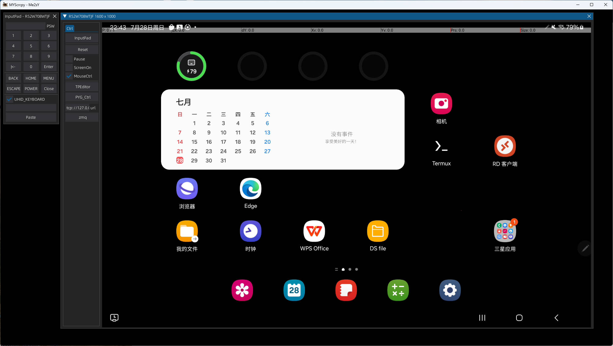

# MYScrcpy

python语言实现的一个 [Scrcpy](https://github.com/Genymobile/scrcpy/) 客户端。

采用 [DearPyGui](https://github.com/hoffstadt/DearPyGui) 作为主要GUI。
同时在某些控制代理场景，使用[pygame](https://www.pygame.org/)作为鼠标及键盘控制映射GUI。pygame提供了鼠标隐藏、按键事件监听等功能，
适用于第一人称相关应用的按键映射。

在5900x + gtx1080 + 三星Galaxy Tab S9 8gen2/小米11pro 888 1920x1080分辨率下， 可以达到6~30ms的延迟。

使用SharedMemory，将视频帧通过内存共享，可以实现 [Nicegui](https://github.com/zauberzeug/nicegui) 的网页绘制展现、
[OpenCV](https://opencv.org/) 图像处理等。


## 特性

- [x] 有线连接安卓设备
- [x] 实现了视频流解析（H264），生成numpy.ndarray，可自行使用opencv、image等进行图形处理
- [x] 实现了音频流解析（FLAC）, 使用 [pyflac](https://github.com/sonos/pyFLAC) 解码，[pyaudio](https://people.csail.mit.edu/hubert/pyaudio/) 播放
- [x] 实现了控制按键映射，鼠标映射
- [x] 实现了UHID-Keyboard UHID-Mouse与鼠标点击混用，可以实现Android界面中鼠标与PC混用模式
- [x] 实现了SharedMemory，不同进程间共享视频画面
- [x] 实现了ZMQ通讯，使用ZMQ pull/push 对手机进行控制
- [x] 实现了GUI下，鼠标滚轮缩放、滑动等功能
- [x] 实现了设备锁屏下，通过InputPad输入密码解锁功能


## 基本使用

1. 使用pip install dist/myscrcpy-1.1.0.tar.gz 或者 克隆本项目至本地
2. 结构如下：
   1. utils.py
   定义基本工具类及各类参数
   2. socket_adapter.py
   Video Socket 及 Control Socket
   3. device_controller.py
   Android Device控制类
   4. gui.dpg
   DearPyGui 界面实现，包括视频绘制，鼠标事件，UHID鼠标、键盘输入，映射编辑等。
   5. gui.pg
   pygame 界面实现，包括视频绘制、鼠标事件、键盘事件控制等。
   6. controller/*
   2024-07-30 1.1.0 版本，实现了Audio解析，同时改进结构。后期以该版本升级GUI
3. 程序引用使用，便于自行开发
```python
# 1.0.1 Version

from myscrcpy.device_controller import DeviceFactory
    
# 通过 DeviceFactory 连接 Android Device
dev = DeviceFactory.device()

# 连接 Scrcpy-Server 获取 Video Socket 及 Control Socket
video_conn, ctrl_conn = dev.connect_to_scrcpy(1920, screen_on=True)

# 获取视频帧 np.ndarray 颜色格式为 RGB
# (height, width, 3) = frame.shape
frame = video_conn.get_frame()

# 发送控制指令
ctrl_conn.send_packet(
  ctrl_conn.touch_packet(
      *args, **kwargs
  )
)
```

```python
# 1.1.0 NEW Version

from myscrcpy.controller import *

device = DeviceFactory.device()
# device = DeviceController(DeviceFactory())


# Connect to Scrcpy
# Create a SocketController and pass to connect method
# None means NOT connect
device.connect(
   vsc=VideoSocketController(max_size=1920),
   asc=AudioSocketController(),
   csc=ControlSocketController()
)

# create zmq
device.create_zmq_server()
sender = ZMQController.create_sender()
sender.send(ControlSocketController.packet__screen(True))

device.vsc.get_frame()
device.csc.f_set_screen(False)
...

```

4.使用GUI

安装
```bash
pip install myscrcpy-X.X.0.tar.gz
```

运行DearPyGui GUI
```bash
python -m myscrcpy.run
```

运行pygame GUI （直接进入控制模式）
```bash
python -m myscrcpy.run -g
```


## 程序截图

主界面


Nicegui Web 界面 （DEMO）


按键映射编辑器


## 所思所想
作为从 Scrcpy 1.X时代就开始使用的老玩家，感叹于Scrcpy的发展及神奇的功能得同时，也一直想做点什么。不过碍于有其他项目（~~懒~~）一直迟迟没有动手。 
直到遇到了[Scrcpy Mask](https://github.com/AkiChase/scrcpy-mask) 这一优秀项目，感觉我也要做点什么了。

遂于24年6月1日开始，阅读Scrcpy源码，使用python语言，借由pyav、adbutils、numpy、pyflac等优秀工具包，形成了MYScrcpy这一项目。

开发初期，是想解决在某些场景下，鼠标操作映射相关问题。随着不断开发，也产生许多涉及图形分析、AI接入（YOLO）、自动控制等方向的新想法。

MYScrcpy是MY（Mxx & ysY）系列的开始，接下来，将继续开发完善这一项目及相关应用。

目前项目为个人开发，时间、精力、水平有限，功能说明等文档方面会逐步完善。欢迎大家使用及指正。也可通过邮箱联系。如果后续有需要，也可以建群联系。

欢迎访问我的 [Bilibili](https://space.bilibili.com/400525682)，之后会录制一些操作及讲解视频，希望大家喜欢。

最后十分感谢我的挚爱在开发中给予的支持。 :heart_eyes:
