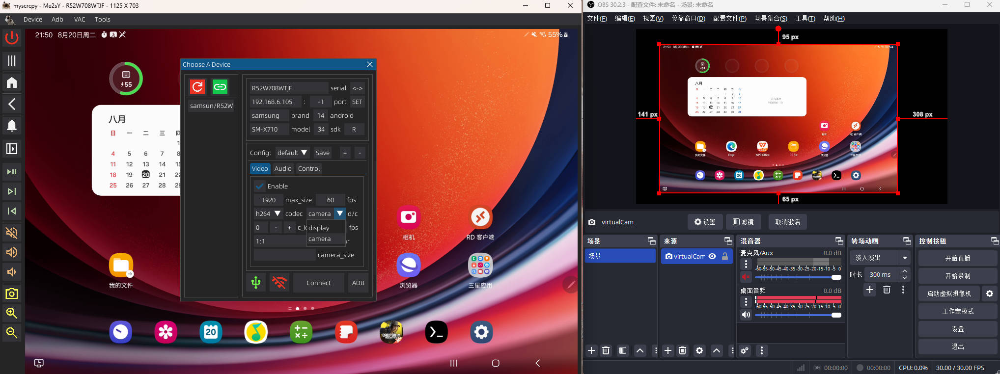
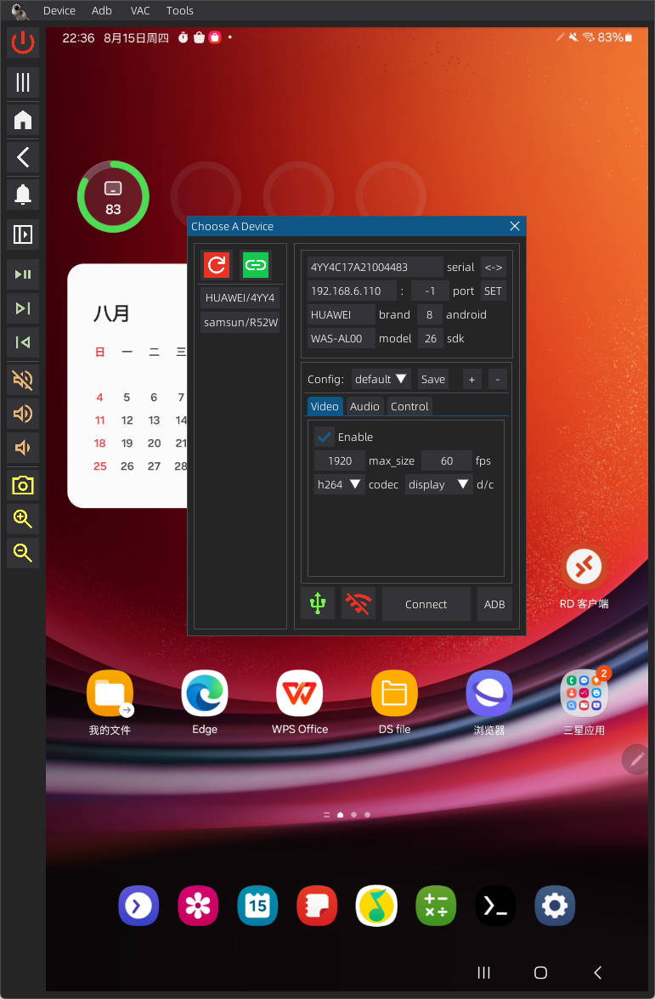

# MYScrcpy V1.3.5

### [中文简介](README.md)

A [Scrcpy](https://github.com/Genymobile/scrcpy/) client implemented in **Python**. 

Includes comprehensive video, audio, and control flow parsing and presentation. **Developer-friendly, ready to use upon integration.**

Uses [DearPyGui](https://github.com/hoffstadt/DearPyGui) as the main GUI. Supports Chinese input, unlocking screen passwords, and other features.

In some control proxy scenarios, [pygame](https://www.pygame.org/) is used for mouse and keyboard control mapping GUI. 

Pygame provides features such as mouse hiding and key event listening, suitable for key mapping in **FPS**.

5900x + GTX1080 + Samsung Galaxy Tab S9 8gen2/Xiaomi 11pro 888 with 1920x1080 resolution, Pygame control mode can achieve **13~30ms** latency.

Using **SharedMemory**, video frames are shared through memory, enabling web rendering with Nicegui and image processing with OpenCV.

Managing Configuration with [TinyDB](https://github.com/msiemens/tinydb).



## Features
- [x] **1.3.3 NEW** Support select audio output devices, With VB-Cables you can simulate microphone input
- [x] **1.3.2 NEW** Video introduction: [BiliBili](https://www.bilibili.com/video/BV1DxWKeXEyA/)
- [x] **1.3.2 NEW** Append [pyvirtualcam](https://github.com/letmaik/pyvirtualcam?tab=readme-ov-file),support OBS virtual camera.
- [x] Supports saving connection configurations and window size.
- [x] Supports wireless connection, connection history, and quick connect features, eliminating the need for complicated command-line input.
- [x] Supports proportional window resizing and freeform stretching.
- [x] Uses TinyDB for dynamic configuration saving.
- [x] Support for reconnecting after disconnection, connection history, and automatic reconnection attempts
- [x] Support for H265 Video Stream
- [x] Video stream parsing (H264) to generate numpy.ndarray for graphic processing with OpenCV, image, etc.
- [x] Audio stream parsing (FLAC) with [pyflac](https://github.com/sonos/pyFLAC) for decoding and [pyaudio](https://people.csail.mit.edu/hubert/pyaudio/) for playback
- [x] Control key mapping and mouse mapping
- [x] Mixed use of UHID-Mouse and mouse clicks, enabling mixed use of mouse on Android and PC interfaces
- [x] UHID-Keyboard for simulating an external keyboard, supporting direct Chinese input (tested with Sogou Input Method)
- [x] SharedMemory for low-latency video frame sharing between processes
- [x] ZMQ communication using ZMQ pull/push for controlling the phone
- [x] Mouse wheel zoom, scroll functions under DPG GUI
- [x] Unlock device screen using InputPad to input password
- [x] Automatic adjustment of device video stream rotation and unrestricted zooming under DPG GUI
- [x] Adjust mouse movement speed with Ctrl In Game Mode
- [x] TwinWindow approach to solve DPG widget overlap issues, implementing DPG control mapping editor (**TPEditor**)
- [x] Minimum latency of 7ms in pure Pygame control mode
- [x] Audio ZMQ Server to transmit audio streams over network sockets, enabling remote sound transmission, MIC monitoring, and more
- [x] Friendly to low Android version devices, automatically disabling Audio, Camera, UHID, etc., for better performance, recommended **Android 12** or above


## Basic Usage

### 1.Install or clone the project
```bash
 pip install myscrcpy-X.X.X.tar.gz
```

### 2.Structure:
   1. **utils.py** Defines basic tool classes and various parameters
   2. **gui/dpg** ~~DearPyGui interface implementation including video rendering, mouse events, UHID mouse and keyboard input, mapping editor, etc.~~
   3. **gui/pg** Pygame interface implementation including video rendering, mouse events, keyboard control, etc.
   4. **gui/ng** _(DEMO) Nicegui Web UI, uses SharedMemory to read video frames_
   5. **controller/** Video stream, audio stream, control stream, device controller, etc.
   6. **homepath/.myscrcpy/tps/*.json** Save TouchProxy configuration files in .json format
   7. **gui/dpg_adv** Next-generation GUI

### 3.For developer
```python
from myscrcpy.controller import *

device = DeviceFactory.device()


# Connect to Scrcpy
# Create a SocketController and pass to connect method
device.connect(
   VideoSocketController(max_size=1366),
   # Use Camera:
   # VideoSocketController(max_size=1366, camera=VideoCamera(camera_size='1280x720', camera_fps=120)),
   
   AudioSocketController(audio_source=AudioSocketController.SOURCE_OUTPUT),
   # AudioSocketServer
   # AudioSocketServer(output=False),
    
   # ControlSocket CAN NOT Create When VideoSocket Source is Camera
   ControlSocketController()
)


# From extensions Import

from myscrcpy.extensions.zmq_server import *
# create ZMQ Control Server
ZMQControlServer(device.csc).start()
sender = ZMQControlServer.create_sender()
sender.send(ControlSocketController.packet__screen(True))

# Get RGB Frame np.ndarray
frame = device.vsc.get_frame()
device.csc.f_set_screen(False)

# ZMQ Audio Server
# from myscrcpy.controller.audio_socket_controller import ZMQAudioServer, ZMQAudioSubscriber
# zas = ZMQAudioServer(device.asc)
# zas.start()

# ZMQ Audio Subscriber
# sub = ZMQAudioSubscriber()
# sub.start()
...
```

### 4.Using the GUI
:exclamation: _On Ubuntu and other Linux systems, installing portaudio first_
```bash
sudo apt install portaudio19-dev
```

#### Run DearPyGui GUI
```bash
python -m myscrcpy.run
```

#### Run pygame GUI (high-speed control mode)

:exclamation: _Using this mode requires pre-configuring the corresponding key mappings in the DPG Gui_

:exclamation: _To pursue performance, this mode excludes rotation and other functions. Device rotation or switching between horizontal and vertical screens may cause termination._
```bash
python -m myscrcpy.run -g
```

## Screenshots

### Main interface


### Nicegui Web interface (DEMO)


### Key mapping editor (TPEditor)


### 7ms latency


## Thoughts
As a long-time user of Scrcpy since the 1.X era, I am amazed by its development and magical features. I've always wanted to do something, but due to other projects (laziness), I never got started.

Until I encountered the excellent project [Scrcpy Mask](https://github.com/AkiChase/scrcpy-mask), I felt it was time to do something.

On June 1, 2024, I started reading Scrcpy source code, using Python language and leveraging excellent tools like pyav, adbutils, numpy, pyflac, and more to create the MYScrcpy project.

Initially, the goal was to solve mouse operation mapping issues in certain scenarios. As development progressed, many new ideas involving graphic analysis, AI integration (YOLO), automatic control, etc., emerged.

**MYScrcpy** is the beginning of the MY (Mxx & ysY) series. Next, I will continue to develop and improve this project and related applications.

Currently, the project is developed personally, with limited time, energy, and skill. The documentation and feature descriptions will be gradually improved. Everyone is welcome to use and provide feedback. You can also contact me via email. If needed, a group can be created for contact.

Welcome to visit my [Bilibili](https://space.bilibili.com/400525682), where I will record some operational and explanatory videos. Hope you enjoy them.

Finally, I deeply appreciate the support from my beloved during the development. :heart_eyes: